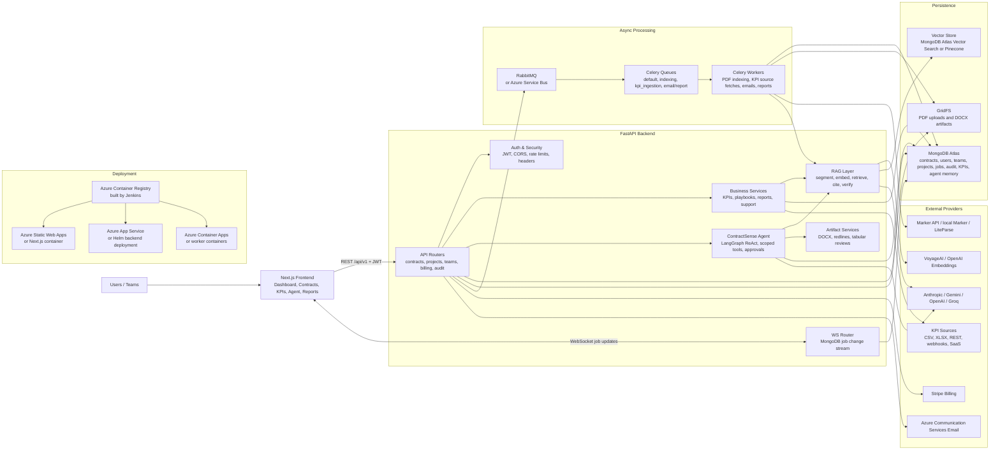
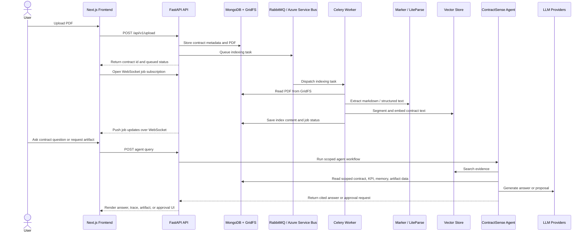

# Platform Architecture

This diagram captures the logical runtime architecture for the ContractLens / ContractSense platform.

For Mermaid-only tools such as Mermaid Live Editor, paste only the diagram code inside a fenced block, or use the raw files:

- [platform-architecture.mmd](platform-architecture.mmd)
- [contract-processing-flow.mmd](contract-processing-flow.mmd)

## Contract Processing Flow

